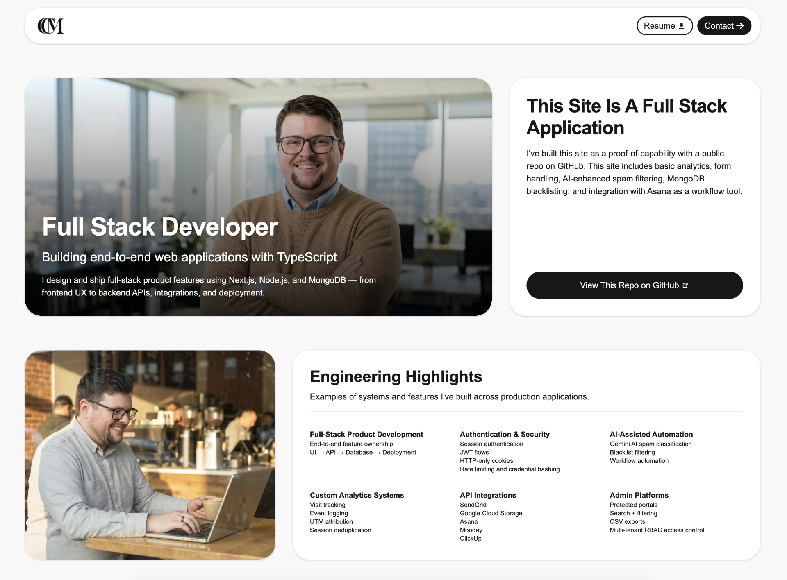
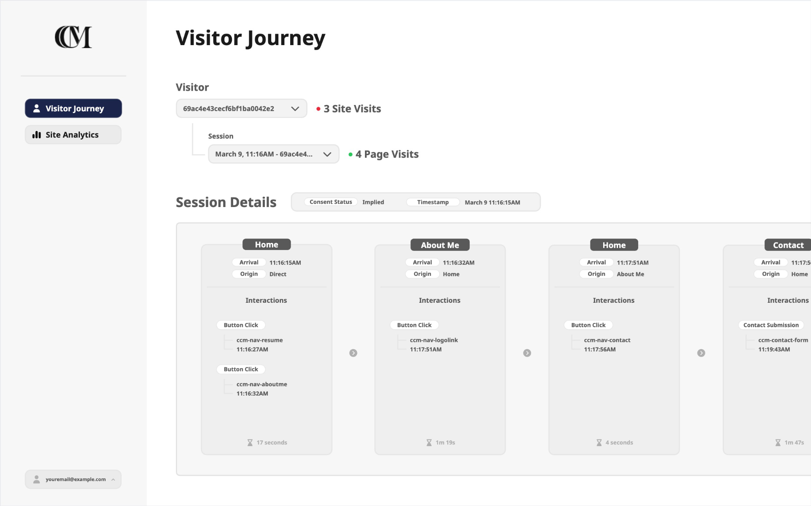

# Corey Collins

**Full Stack Developer**  
TypeScript • Next.js • Node.js • MongoDB

I build end-to-end web products — from frontend UX to backend APIs, integrations, analytics, and deployment.

[View the Wiki](https://github.com/coreycollinsm/coreycollinsm/wiki) to learn more about this project.
I am looking for a job as a full-stack developer. Learn more by reading my [job wiki page](https://github.com/coreycollinsm/coreycollinsm/wiki/I-Am-Looking-For-A-Job)

## Featured Projects

# This Project

| Project                        | Description                                                                                     | Key Capabilities                                                                                                            | Tech                                     | Repositories                                                                                                           |
| ------------------------------ | ----------------------------------------------------------------------------------------------- | --------------------------------------------------------------------------------------------------------------------------- | ---------------------------------------- | ---------------------------------------------------------------------------------------------------------------------- |
| **Portfolio Analytics System** | Lightweight analytics platform capturing page visits, attribution sources, and UI interactions. | Anonymous session tracking UTM attribution Button click event tracking MongoDB event schema API event ingestion | Next.js • Node.js • MongoDB • TypeScript | [ccm-api](https://github.com/coreycollinsm/ccm-api)    [ccm-portal](https://github.com/coreycollinsm/ccm-portal) |

 

Site Screenshot:

# CCM Platform Architecture

| Layer              | Technology                                                            |
| ------------------ | --------------------------------------------------------------------- |
| **Frontend**       | Next.js, React, TypeScript                                            |
| **Backend**        | Node.js, Express                                                      |
| **Database**       | MongoDB / MongoDB Atlas                                               |
| **Infrastructure** | Netlify (frontend), Render (API), MongoDB Atlas                       |
| **Integrations**   | SendGrid, Google Cloud Storage, Gemini AI, Asana, Monday.com, ClickUp |

 

# Next Steps

Future development for the CCM ecosystem includes the **portal application**.

| Project        | Purpose                                                                   | Repository                                  |
| -------------- | ------------------------------------------------------------------------- | ------------------------------------------- |
| **ccm-portal** | Admin dashboard and operational tools for analytics and system management | https://github.com/coreycollinsm/ccm-portal |

Portal concept mockup:

 

# Links

| Resource  | Link                                       |
| --------- | ------------------------------------------ |
| Portfolio | https://coreycollinsm.com/                 |
| LinkedIn  | https://www.linkedin.com/in/coreycollinsm/ |
